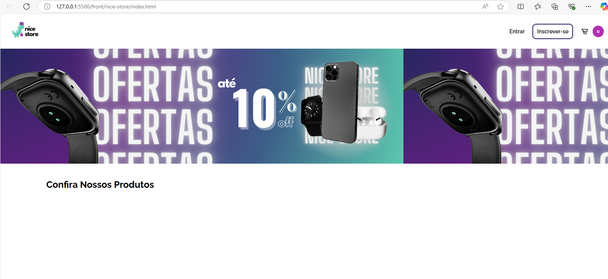

 

# Sobre o Nice Store
_Nice Store_ é um site de vendas (E-Commerce) de produtos elétricos e eletrodomésticos com Sistema Web de Back-Office integrado. 
_Nice Store_ é o resultado do projeto acadêmico de Sistema Web desenvolvido pelos alunos do _[Centro Universitário Senac](https://www.sp.senac.br/centro-universitario-senac-santo-amaro 'Site Oficial Senac')_ ao decorrer da matéria _**"Projeto Integrador - PI" do 4º semestre.**_ 

- Realiza _Pedidos de Vendas_ fictícios.
- Engloba todos os pontos cruciais de um _Sistema Web._
- Utiliza padrões de Arquitetura de Sistemas Web desde o _EndPoint_ até inserção/alteração no _Banco de Dados_.

 

## O Projeto - Desenvolvimento de Sistemas Orientado a Web.

O objetivo inicial do projeto é desenvolver um site E-Commerce de vendas de produtos com Sistema de Backoffice integrado. Para atender o objetivo proposto os alunos devem utilizar todo o conhecimento adquirido durante o curso de _Análise de Desenvolvimento de Sistemas_, entre elas estão algumas como:
 - Utilizar a linguagem **Java** com framework **SpringBoot** no Back-End;
 - Utilizar o padrão de arquitetura **Model View Controller - MVC**;
 - Disponibilizar uma interface Front-End para interação com Usuário;
 - Utilizar Metodologia ágil **Scrum**.
 
Na entrega final, o projeto de Sistema E-Commerce deve atender a uma lista de requisitos e funcionalidades previamente descritas pelo instrutor em forma de _Backlog de Produto_, a cada funcionalidade que o Sistema atenda com sucesso, o grupo receberá os pontos como nota final da matéria. Em resumo, os requisitos são:

- O Sistema deve ser capaz de efetuar um _login_ de `Administrador` no `Back-Office` e com esse _login_, `criar`, `alterar`, `salvar` e `excluir` perfis do tipo `Administrador`/`Estoquista`;
- O Sistema deve ser capaz de efetuar um _login_ de `Estoquista` no `Back-Office` e com esse _login_, _visualizar_ e `alterar` status de pedidos dos clientes;
- O `Cliente` deve ter a possibilidade de _visualizar e escolher_ produtos na tela inicial e colocá-los no `carrinho` (sem que esteja previamente logado);
- O `Cliente` deve criar um `cadastro` para concluir seu `pedido`, caso já tenha um cadastro ativo, deve _logar_ para concluir o seu `pedido`.
- Além de criar o `cadastro`, o `Cliente` deve ter a possibilidade de `alterar` determinadas informações do `cadastro` e adicionar `endereços`.
- Durante o processo de compra, o `Cliente` logado deve passar por todas as etapas de conclusão de pedido: escolher `produto` e colocar produto no `carrinho`, adicionar um `endereço` fictício de entrega, adicionar `pagamento` fictício, `visualizar` um resumo e detalhes do pedido na tela de `checkout`.
- `Cliente` deve _visualizar_ uma `lista de pedidos` realizados e seus detalhes dentro do seu `perfil`.

O Objetivo final do Projeto é simular uma aplicação de um Sistema Web de E-Commers de vendas, contribuindo para experiência prévia do aluno ao mercado de trabalho. [_Mais detalhes sobre o Projeto Integrador do Senac_](./Projeto-Integrador.md).

>Mais informações sobre o Desenvolvimento do Projeto, detalhes da Metodologia, _[SprintPlaning](./files-docs/Project/Sprints.md 'Mais Detalhes Sprints') e [Backlog do Produto](./files-docs/Project/Backlog.md 'Mais detalhes Backlog')_.

# Ferramentas Utilizadas
- **Back-End :** Linguagem Java 17 e Java Script para integração de API Rest;
- **Framework:** Java Springboot;
- **Banco de Dados:** MySQL;
- **Front-End:** HTML/CSS/JavaScript;

Para executar a metodologia ágil _**Scrum**_ foi utilizada a plataforma _**Trello**_ como _To Do List_ e gerenciamento das _Sprints._

>Acesse mais detalhes técnicos do Sistema como [Telas](); [API e EndPoints](); [Modelagem Banco de Dados](); [Estrutura do Banco de Dados]() e [Documentação]().

# Como executar Nice Store
Se você tem interesse em visualizar o projeto final e sua execução disponibilizamos a sessão [Instruções de Uso](./files-docs/Uso.md) para visualização completa do funcionamento em sua máquina.

# Contribuintes
Nice Store foi desenvolvido em grupo pelos integrantes:
- Igor Felipe da Silva (Este Perfil);
- [Guilherme Matheus](https://github.com/Domiuau);
- [Eliana Lima](https://github.com/eliana-eml);
- [Nathalia Narumi](https://github.com/nathalianarumi);

# Licença
Este projeto possui licença XXX que permite a visualização e utilização para fins educacionais. Não pode ser revendido ou comercializado.
