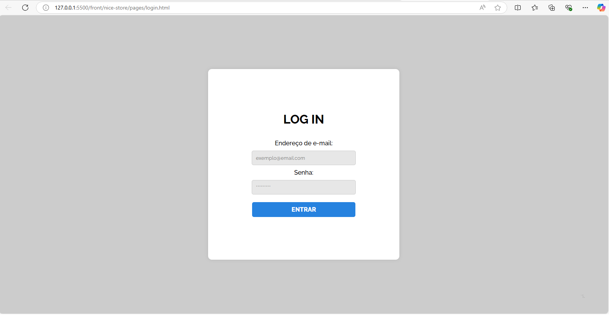
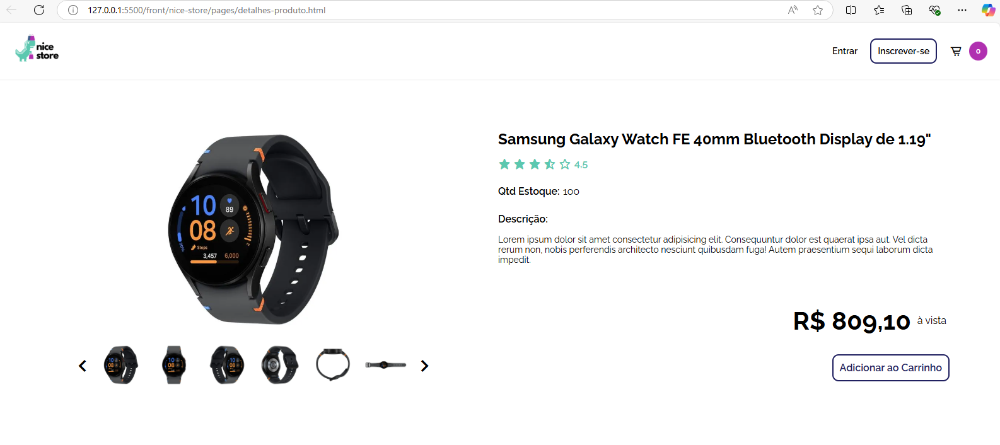

# Imagens do Projeto

# Página Inicial 

>Tela Principal onde contém um banner/link de itens em promoção, botão de entrar na conta, se cadastrar e acesso ao carrinho e alguns dos produtos cadastrados.

# Login 

>Essa tela permite a realização do acesso a conta de perfil `Cliente`

>Tela que permite o acesso a `Usuários` do BackOffice (necessário ter perfil `Administrador` ou `Estoquista`).

# Cadastros

>Tela para realização de cadastro de um novo `Cliente`.

>Tela para realização de cadastro de um novo `Produto`.

# Produtos e Carrinho

> Tela de detalhemento e maiores informações de um `Produto`.